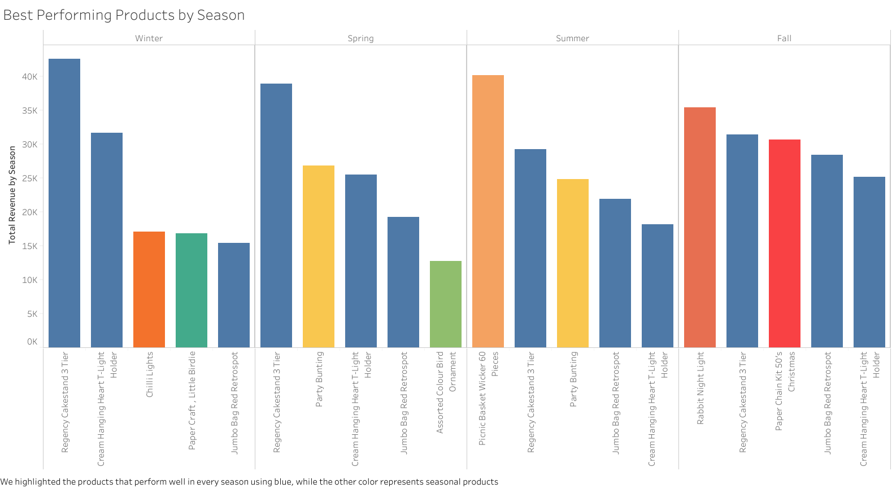

# UK Online Sales Analysis
## Project Background
In this project, we analyzed a UK-based online retail dataset to uncover meaningful business insights. The company primarily sells home goods, gifts, and lifestyle products. While the majority of its transactions occur within the UK, it also serves international customers on a smaller scale. Key business metrics include revenue, quantity sold and customer location. We acquired one year of data spanning from December 2010 to December 2011.
### We aim to answer the following business questions:
-	Which individual products and product categories generate the highest revenue and quantity sold across the entire dataset?-
-	Are there noticeable monthly or seasonal patterns in customer purchasing behavior throughout the year?
-	Which countries or regions contribute the most to total revenue, and how does revenue distribution vary across locations?
### Insights and recommendations are organized around the following key areas:
-	Top-performing categories and products
-	Monthly and seasonal sales trends
-	Regional sales performance
The SQL queries used to inspect and clean the data for this analysis can be found here.
Targeted SQL queries addressing key business questions are available here.
An interactive Tableau dashboard to explore sales trends can be found here.
## Data Structure & Initial Checks
The database for this analysis consists of three tables, online_sales, product_category and continents with more than 300,000 rows in total.

These tables were joined and cleaned using SQL to ensure accurate analysis.
# Executive Summary

During this one-year period, our company generated a total revenue of £8,519,675. While we operate globally, our primary market remains the UK, contributing 86.77% of the total revenue. While we operate globally, our data highlights significant opportunities for targeted expansion, particularly within Europe.
The most promising region is Europe, where we made £1,273,943, accounting for 85.11% of our revenue outside of the UK. Other regions generate significantly less revenue, such as Oceania (£139,071), Asia (£71,173), and the Americas (£8,839).
Four European countries account for 73% of the total European revenue. These countries are:

- Netherlands: £284,675
- Ireland: £257,654
- Germany: £205,389
- France: £183,802

The next highest contributor, Spain, generated only £55,000, indicating a steep drop-off beyond these core markets. These four European countries already show a big demand in our products and also share  market similarities with the UK, making them ideal targets for strategic expansion.
An analysis of regional sales by product revealed that in the Netherlands, there is a particularly high demand for bag and box category products. This indicates  that a  targeted marketing campaign focusing on these categories significantly boost performance in that market.

## Insight Deep Dive

### Top Products and Categories
- Main Insight 1: The Regency Cake Stand (3 Tier) is the highest revenue-generating product, with over £140,000 earned despite relatively low quantity sold. This indicates it's a premium product with a high price point and strong individual value.
- Main Insight 2: The Bag category is the company’s best overall performer, leading both in total revenue and units sold, making it the most consistently high-performing product group.
  
- Main Insight 3: After segmenting products into performance groups, we found that the "Best Performer" group (high revenue and quantity) drives the majority of income. These products are critical for profitability and must always be in stock; strong inventory management is essential.
- Main Insight 4: Products in the "High Margin, Low Reach" group are also important. They represent premium goods that generate high income per sale despite lower volume. These are ideal for targeted marketing or gifting promotions.
- Main Insight 5:  The weakest segments are "Low Performer" and "High Volume, Low Income" products. These may be consuming storage and logistical resources without strong returns. We recommend testing bundling strategies or phasing out underperformers consistently showing poor results.
### Seasonal Trends

- Main Insight 1: Fall is the strongest sales season, generating over £3M in revenue, followed by Summer and Winter. This highlights a clear opportunity for focused promotional campaigns in Q3 and Q4.
- Main Insight 2: Revenue peaks in October and November, reflecting a strong pre-holiday buying cycle. Notably, November alone brought in over £1.13M, making it the single highest-grossing month in the dataset.
  
- Main Insight 3: The Regency Cakestand, Jumbo Bag Red Retrospot, and Cream Hanging Heart T-Light Holder are consistently high-performing products across all seasons. The Regency Cakestand, in particular, peaks in Spring and Winter, suggesting it may be linked to gifting or seasonal events.
 Seasonal products perform exceptionally well in Fall and Summer. The Rabbit Night Light and Paper Chain Kit (50’s Christmas) ranked in the top three by revenue during Fall, while the Picnic Basket Wicker (60 Pieces) was by far the top performer in Summer, likely due   to outdoor and leisure demand.
### Regional Sales Performance

-	Main Insight 1: The company is heavily reliant on the United Kingdom, which contributes 86.77% of total revenue. While this shows strong local dominance, it also highlights a concentration risk and the need to diversify.
-	Main Insight 2: Europe (without the UK) generates over 85.11% of its international revenue, significantly outperforming other regions such as Oceania (9.29%), Asia (4.75%), and the Americas (0.52%).
-	Main Insight 3: Within Europe, the Netherlands stands out as the top-performing international market, generating £284K, followed by Ireland, Germany, and France. These countries consistently contribute over £180K each, suggesting established customer bases worth developing.
-	Main Insight 4: Category-level analysis shows that Bags and Boxes are consistently the best-selling items across international markets — particularly in the Netherlands, where their revenue outpaces other categories significantly. This insight supports the idea of region-specific promotions tailored to popular product lines.
## Recommendations
- Strengthen stock and marketing for high-performing products
 Ensure continuous availability of top sellers like the Regency Cakestand, Cream Hanging Heart T-Light Holder, and Jumbo Bag Red Retrospot. These products are the companies revenue drivers .
- Prioritize inventory planning for Q3–Q4 and event-driven sales
  With Fall and November being peak revenue periods, planning stock replenishment and promotions early is essential. Seasonal products like Christmas kits and gift-ready lighting should be emphasized in October campaigns.
- Target expansion and marketing in high-potential European markets
  Focus digital campaigns on the Netherlands, Ireland, Germany, and France, which already show traction. These countries are proven contributors and offer scalable international revenue opportunities.
- Reassess underperforming product lines
 Products classified as Low Performers or High Volume, Low Income may not be worth continued investment. 

